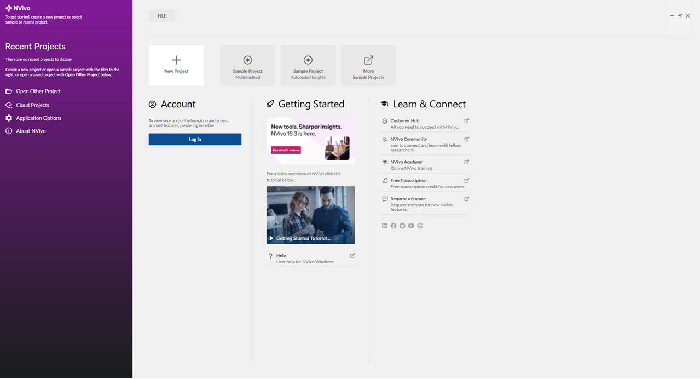
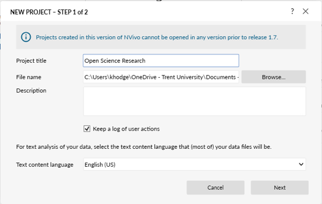
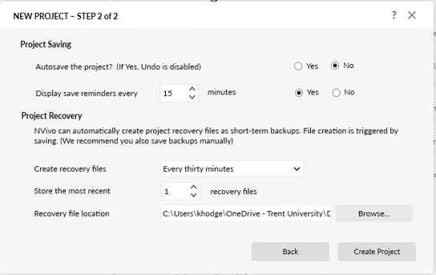
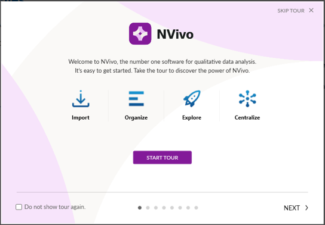
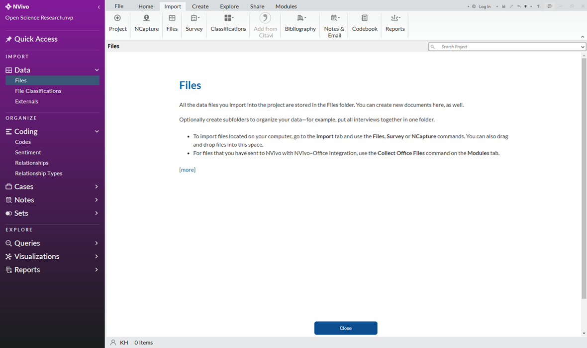
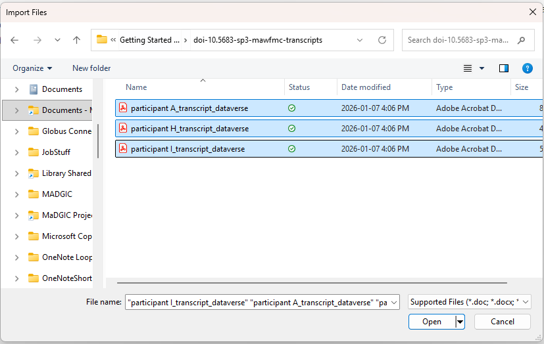
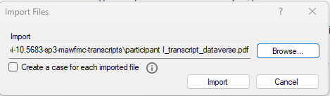

# Creating an NVivo Project
**Note:** If applicable, ensure your file and recovery locations comply with ethics requirements.

1.	Launch NVivo software
2.	Review resources on the landing page. (Note- Free transcription and cloud projects not covered/subscribed to by Trent)
3.	Click “New Project”.

4.	Add a “Project title” (e.g. “Open Science”)
5.	Browse to an appropriate “File Name” location to store your project.
6.	By default, the “Keep a log of user actions” is checked.

7.	Click “Next”.
8.	Accept the defaults and note the recovery file location folder.
9.	Click “Create Project”.
 

# Navigating the NVivo Interface
1.	Start the NVivo tour to learn more about the interface.

2.	Review the project components on the navigation view (left pane). Anything you import or create is accessible from here.
3.	Review the project tools across the ribbon view (top pane).

# Importing Data
**Note:** You can import various types of data into NVivo, and there are several methods for importing. This workshop focuses on importing PDFs.
1.	Click “Import” > “Files” on the ribbon view (top pane). “Files” lets you import documents, PDFs, audio, video, images, and other file types. 

2.	Navigate to the data you want to import on your device, select all the files, and click “Open”.
   E.g. Import your own files or the PDFs in [NVivo Workshop Material](files/NVivo_Workshop_Material.zip)
  	
   - doi-10.5683-sp3-mawfmc-transcripts\participant A_transcript_dataverse.pdf
   - doi-10.5683-sp3-mawfmc-transcripts\participant H_transcript_dataverse.pdf
   - doi-10.5683-sp3-mawfmc-transcripts\participant I_transcript_dataverse.pdf
   - Academic impact of open science.pdf
   - Factors influencing open science participation through research data sharing and reuse among researchers.pdf
     

3.	Click “Import”. **You will need to repeat steps 1-2 if the files are in different folders.**
     
