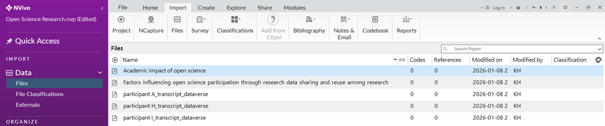
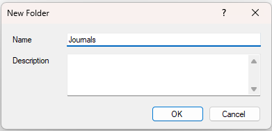
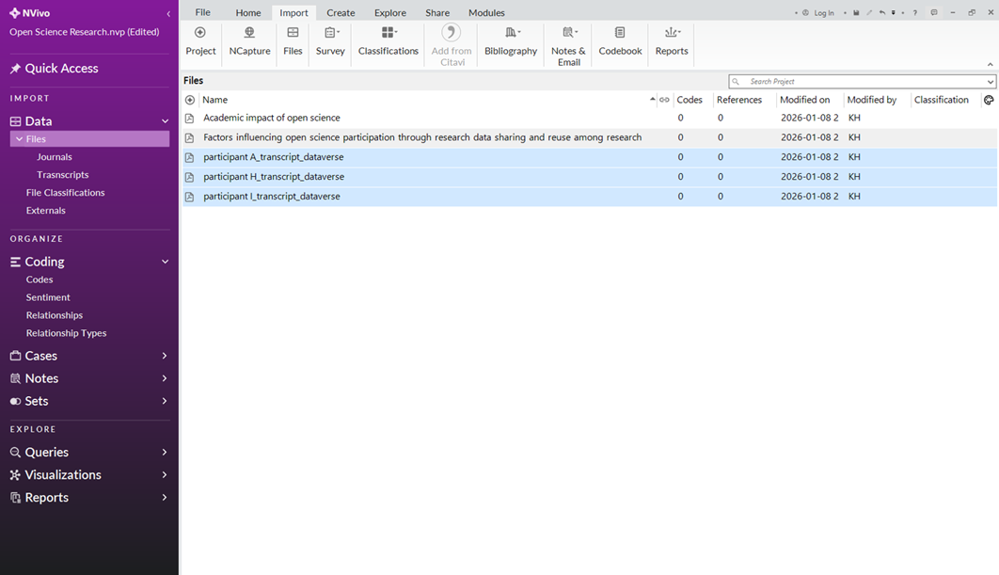
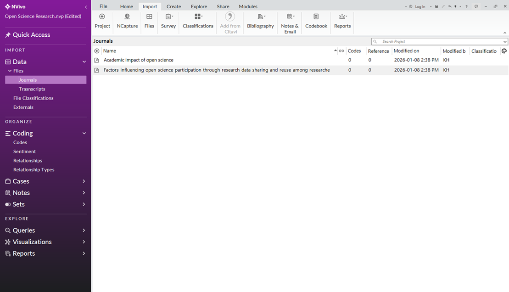

# Organize your Data
**Note:** Use subfolders to help organize your data. 

## Create Folders
1.	To create data subfolders, right-click on “Files” found under “Data” on the navigation view (left pane).

  

2.	Click “New Folder” on the drop-down menu. 
3.	Name the folder “Journals”. Description is optional. Click “Ok”.

  

4.	**Repeat steps 1-4** to create a second folder. Name it “Transcripts”.

## Add Files to a Folder
1.	Click back into the “Files” folder.

  

2.	Click and drag the “journal articles” files into the subfolder (“Journal Articles”).

  

3.	Click and drag the “transcript” files into the subfolder (“Transcripts”).
