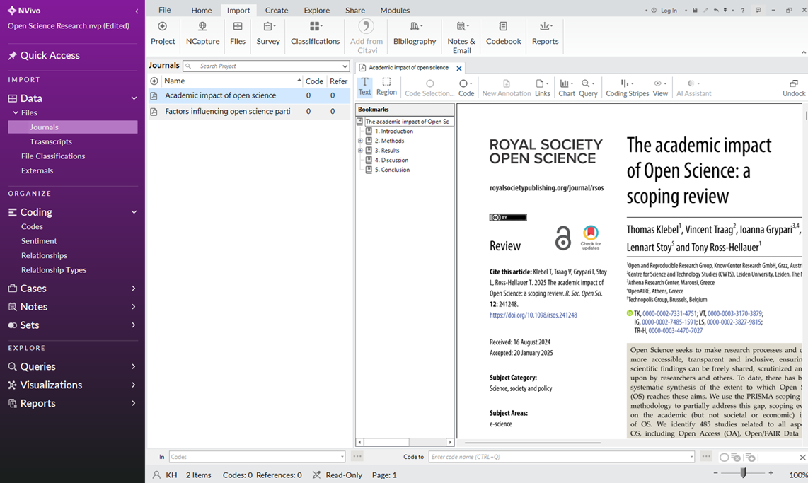
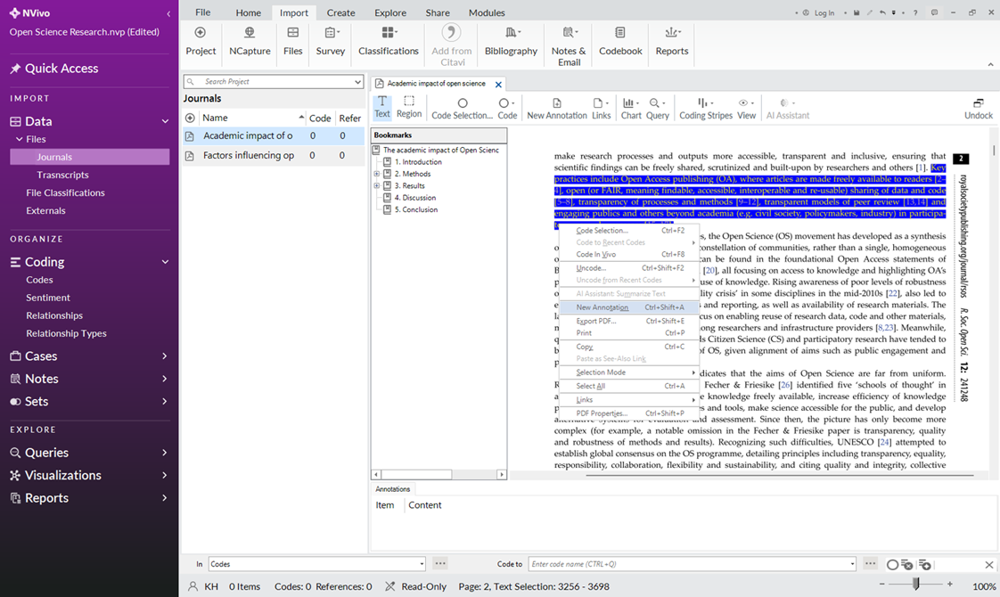
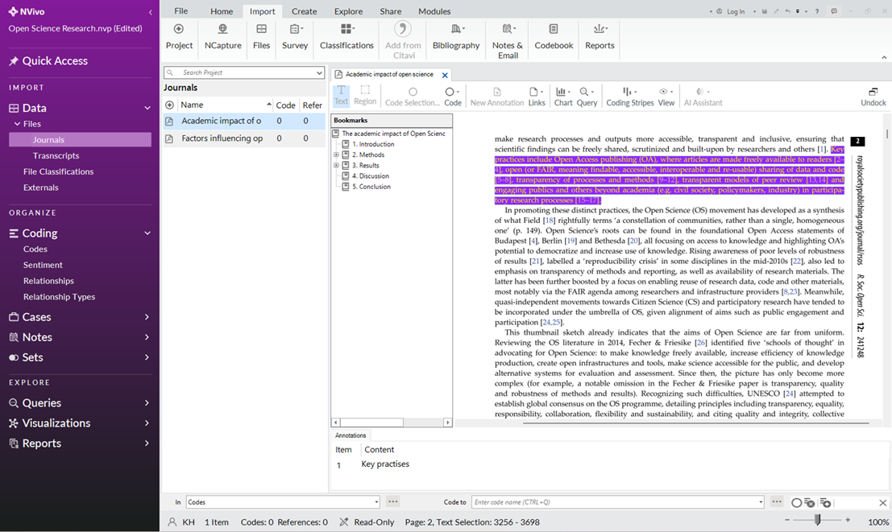
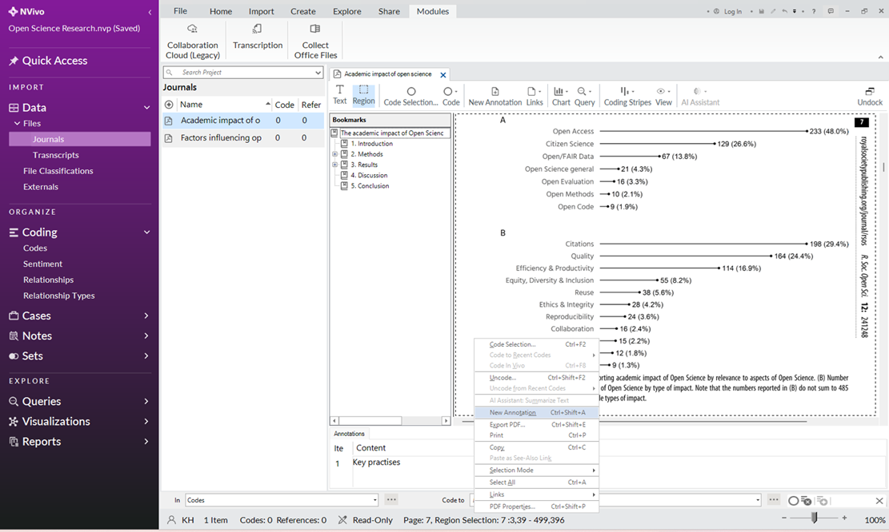
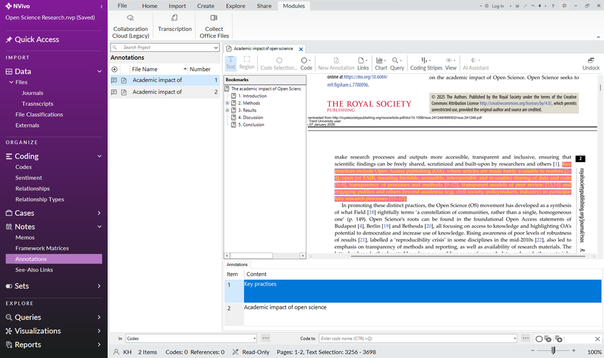

# Creating Annotations
**Note:** Annotations are suitable for linking a note to a specific piece of text in a document. These instructions are for annotating text and a graphic in a PDF file.

## Annotate Text
1.	Click the “Journals” subfolder, under “Files” on the navigation view (left pane).
2.	Double-click on “Academic impact of open science” to open it in detail view.

3.	Click and drag your mouse to highlight some text in the PDF.
4.	Right-click over the text you highlighted.
5.	Click “New Annotation” in the drop-down menu.

6.	NVivo will create an annotation box for you at the bottom of the screen – type your thoughts in this blank field. (E.g. "Key Practises")

7.	Click anywhere outside of the annotation field to save your annotation.

## Annotate a Region
**Note:** Annotate a picture or text in a PDF that you can't select using the ‘Region’ selection. 
1.	Click “Region” at the top of the PDF tools ribbon.
2.	Click and drag your mouse across a portion of the PDF to select a region.
3.	Right-click over the region you selected.
4.	Click “new annotation” in the drop-down menu.

5.	NVivo will create an annotation box for you at the bottom of the screen – type your thoughts in this blank field. (E.g. "Academic impact of open science")
6.	Click anywhere outside of the annotation field to save your annotation.

## Reviewing Annotations
1.	Click the “Annotations” subfolder, under “Notes” on the navigation view (left pane).
2.	Double-click an annotation to open the related document/highlighted text.

3.	Click the number under the “Item” column in the annotation box to navigate between multiple annotations in a document.
