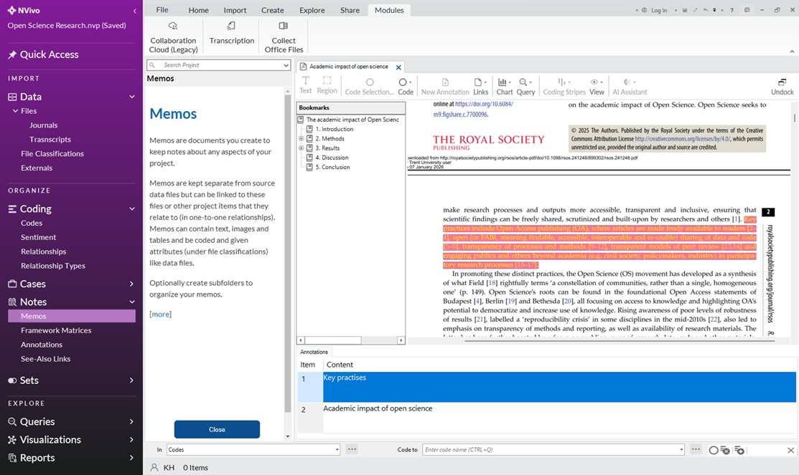
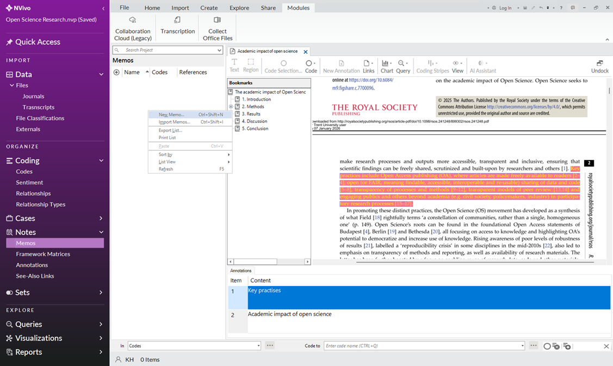
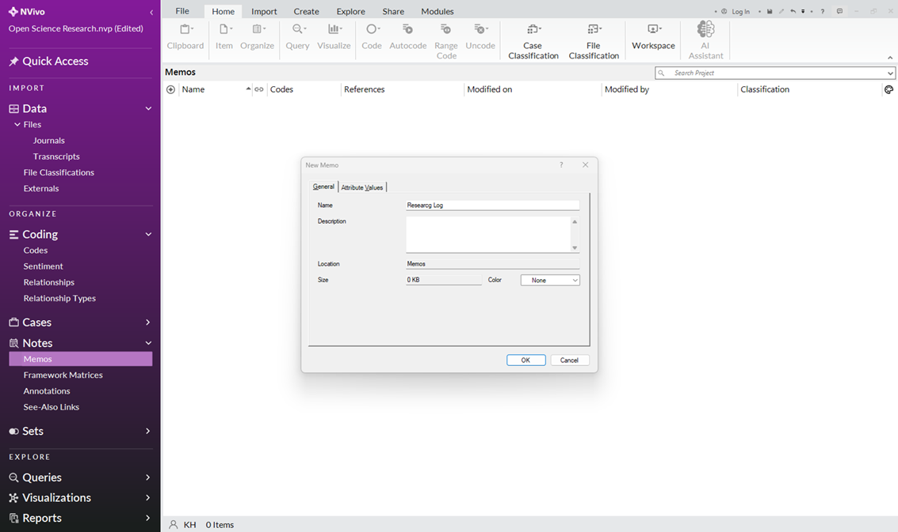
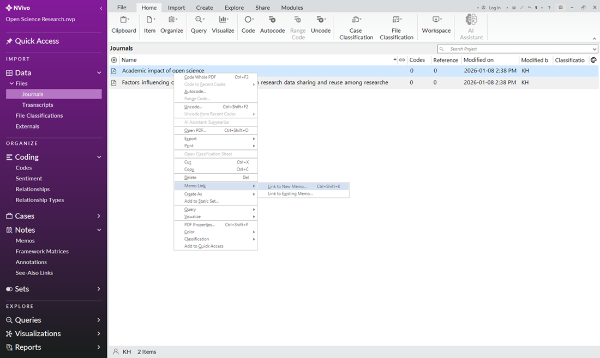
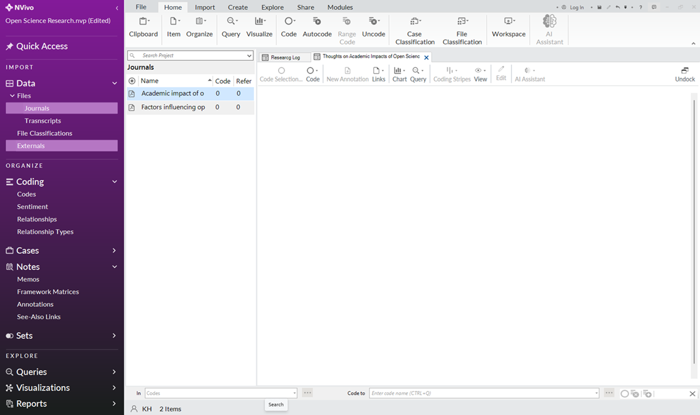
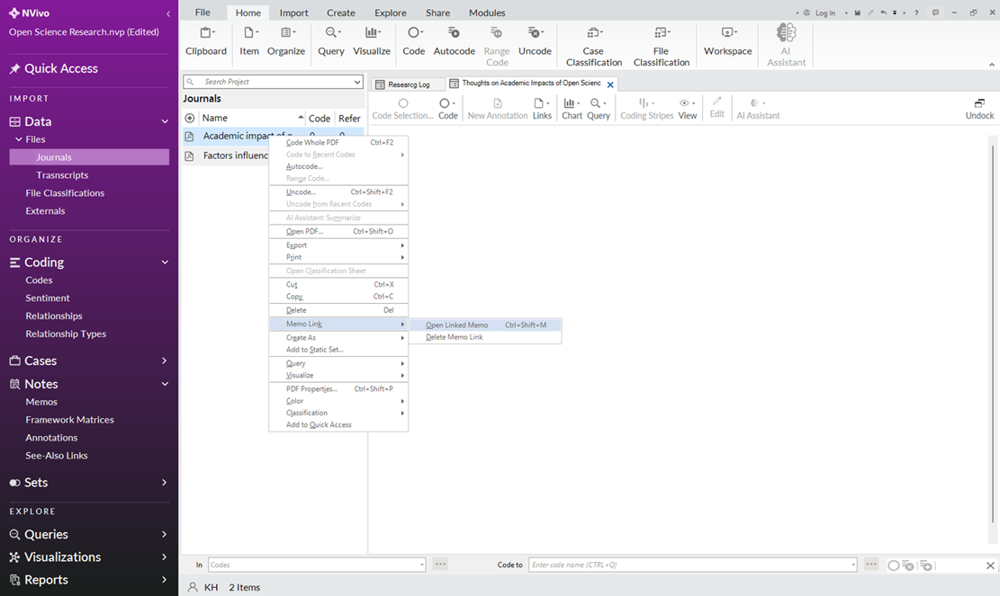

# Creating Memos
Memos are suitable for documenting general notes about the project (e.g. summary report). These instructions are for annotating text in a PDF file.

## Create Unlinked Memos
1.	Click the “Memos” subfolder under “Notes” on the navigation view (left pane).
2.	You may see an explanation from NVivo called “Memo”, click close.

3.	Right-click in the white space (list view) under the Memos window.
4.	Click “New Memo” in the drop-down menu. 

5.	Name this memo “Research Log” (description optional).

6.	Click “Ok”. 

## Create Linked Memos
Memos can only be linked one-to-one (one memo to one piece of data).
1.	Click the “Journals” subfolder under “Files” on the navigation view (left pane).
2.	Right-click on “Academic impact of open science”.
3.	Hover your mouse over “Memo Link”. 
4.	Select “Link to New Memo”.

5.	Name this Memo according to your needs (e.g. “Thoughts on Academic Impacts of Open Science”) – description optional.
6.	Click “Ok”.

## Reviewing Memos
1.	Review your Memos by clicking on the “Memos” subfolder under “Notes” on the navigation view (left pane).
2.	Double-click a memo to open it. 
3.	To open a linked Memo directly from the “Files” view, right-click on the file (e.g. Academic Impacts of Open Science).
4.	Hover your mouse over “Memo Link”.
5.	Click “Open Linked Memo”.

6.	To continue editing a memo: make sure the box that says “Edit” at the top of the Memo ribbon is checked on.
