# Coding
Coding is the process of labelling data for better organization and retrieval. There’s no single correct way to code; what matters is that your system makes sense to you. Naming your codes is entirely up to you, allowing for creativity in your choices.

## Deductive Coding
Deductive coding is when you already know the codes you want to create.
1.	Click “Codes” found under “Coding” on the navigation view (left pane).
2.	You may see an explanation from NVivo called “Codes”, click close.
3.	Right-click in the white space under the “Codes” window.
4.	Click “New Code”
5.	Name the Code according to your needs (e.g. “Q1”) – description optional but highly recommended for consistent and describable coding categories.
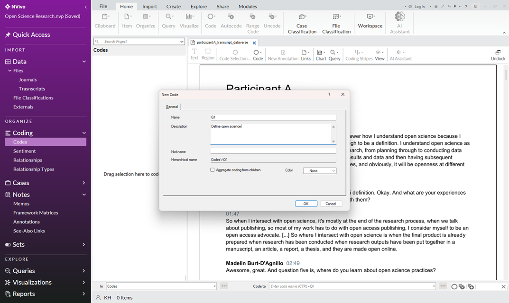

6.	Open your research data (e.g. participant A_transcript_dataverse, the first document under the “Transcripts” files subcategory).
7.	Highlight a portion of the text related to the existing code.
8.	Click into the blank field beside “Code To:” at the bottom center of your screen.
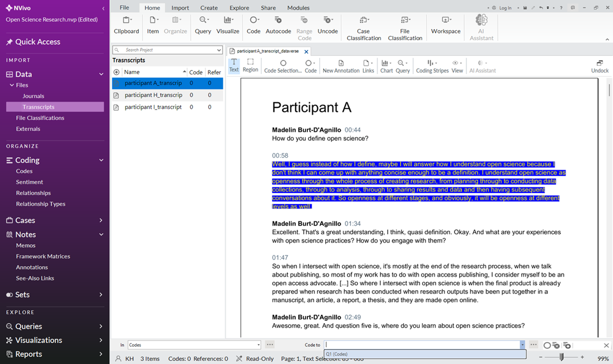

9.	Start typing the relevant code (e.g. Q1) and the codes will automatically pop up.
10.	Click on your desired code. 
11.	Click Enter on your keyboard. 
**Note:** You can use the “…” on your coding bar to select multiple codes at the same time.

## Inductive Coding
Inductive coding is a process whereby you create codes as you review the data.
1.	Open your research data (e.g. participant A_transcript_dataverse, the first document under the “Transcripts” files subcategory).
2.	Highlight a portion of the text related to the new code.
3.	Click into the blank field beside “Code To:” at the bottom center of your screen.
4.	Type in the name of the new code (e.g. Research Data Management).
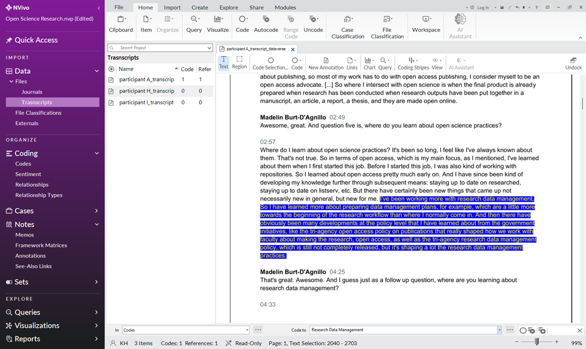

5.	Click Enter on your keyboard. 

**Note:** You will only see available codes in your coding bar if the first option in the coding bar at the bottom of your screen is set to “In: Codes”.

## Reviewing Codes
### Viewing Codes
1.	With a coded document open (e.g. participant A_transcript_dataverse), click “Coding Stripes” in the tool ribbon (e.g. Document or PDF) at the top of your screen.
2.	Click “All” under “Show Coding Stripes”, this will give you an overview of the codes in your data on the right side of your screen.
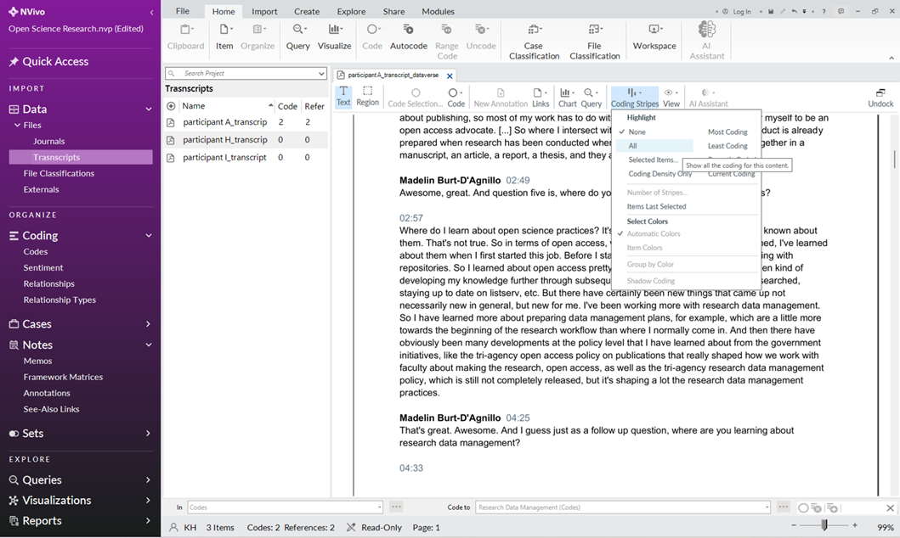

3.	Click “View”.
4.	Click “All Coding”. This will highlight all of the text that you have coded in your data.
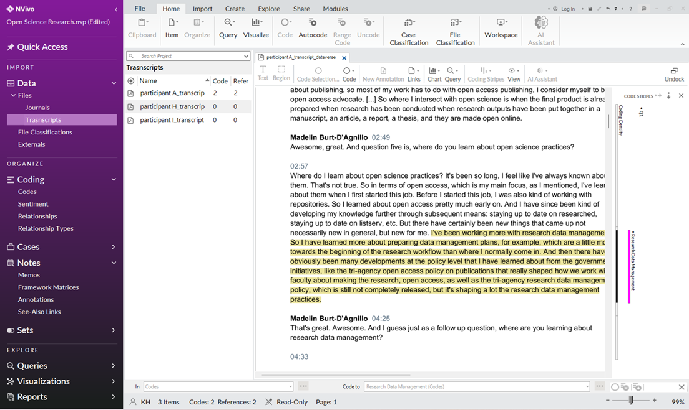

### Viewing and Editing Coded Data
1.	Click back into “Codes” found under “Coding” on the navigation view (left pane).
2.	Double-click on a given code (e.g. Q1) to bring up all the data that has been coded to that category.
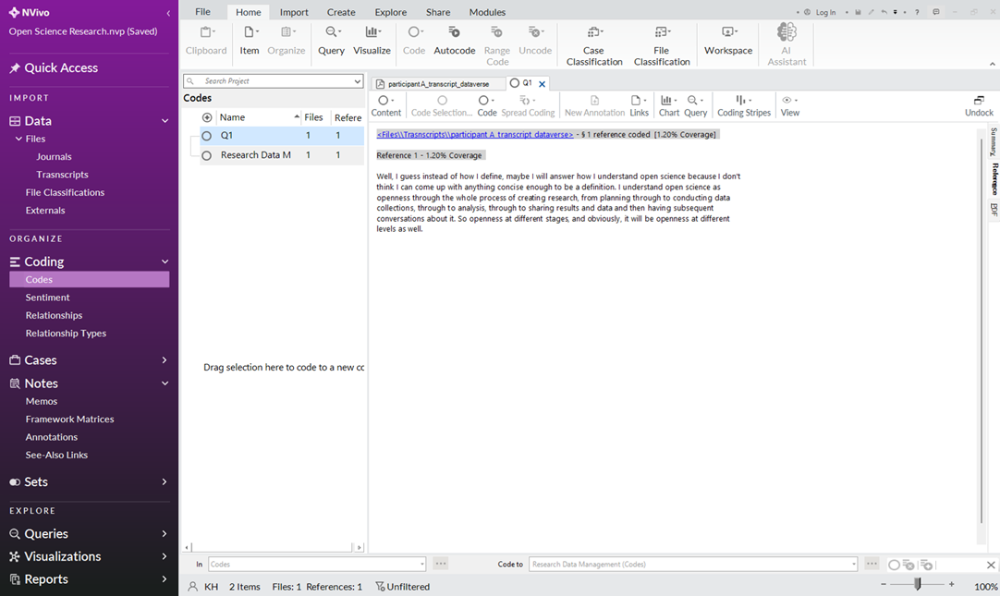

3.	To uncode all or a portion of your coded data from the category in question (e.g. uncode from Q1), highlight the code you want to remove.
4.	Right-click and select “Uncode from This Code”
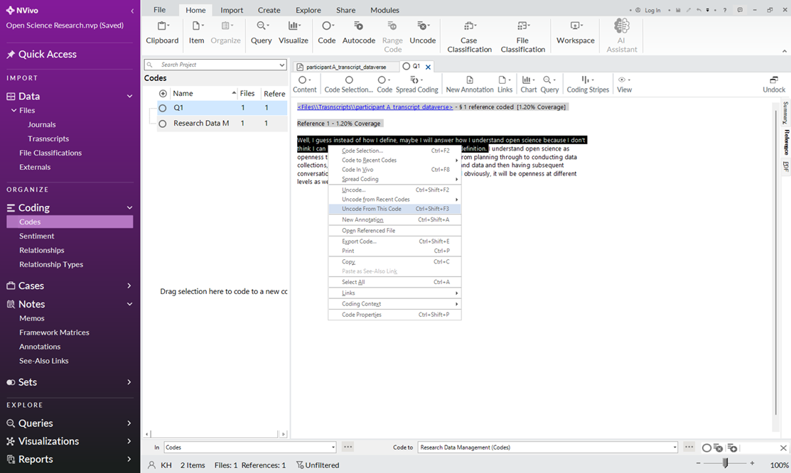
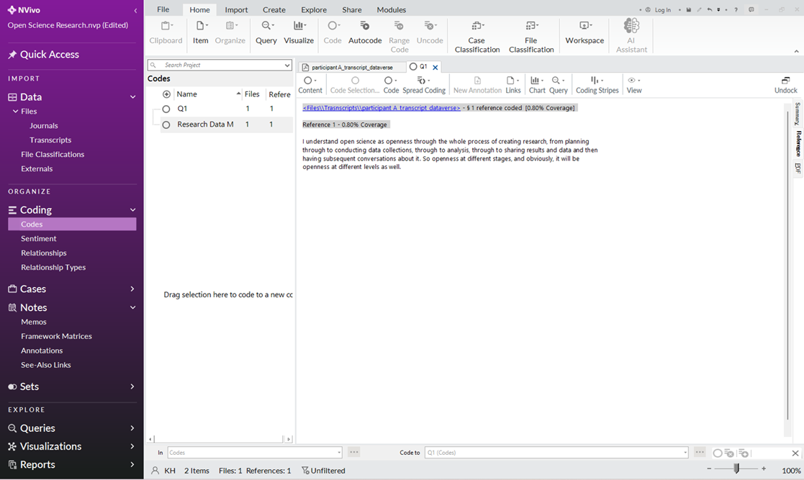

## Organizing and Editing Your Codes
Codes can be organized into hierarchical relationships.

### Create a Parent & Child (Subcategory) Code
1.	Click back into “Codes” found under “Coding” on the navigation view (left pane).
2.	Right-click in the white space under the “Codes” window.
3.	Click “New Code”
4.	Name the Code according to your needs (e.g. “Interview Questions”) 
5.	Click and drag the child (subcategory) code (e.g. Q1) onto the desired parent code (e.g. Interview Questions)
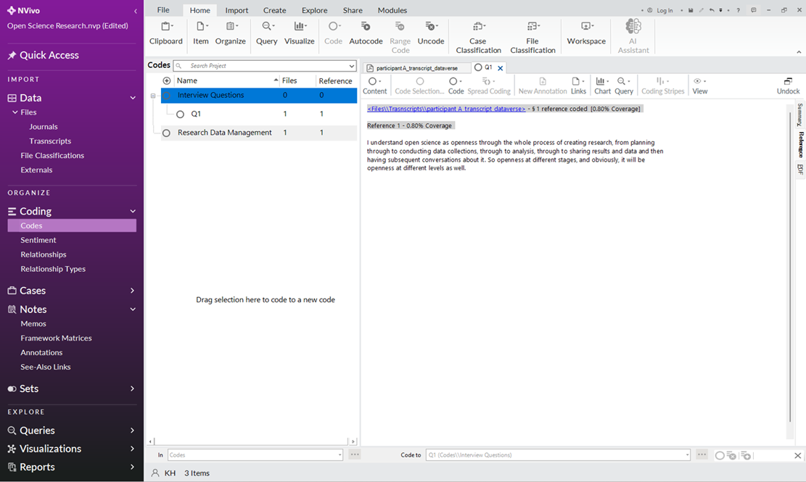

6.	Click the “+” sign next to the parent code to view the child codes.

### Convert a Child (Subcategory) Code to a Parent Code
1.	Right-click on the subcategory code (e.g. Q1).
2.	Select “Cut”
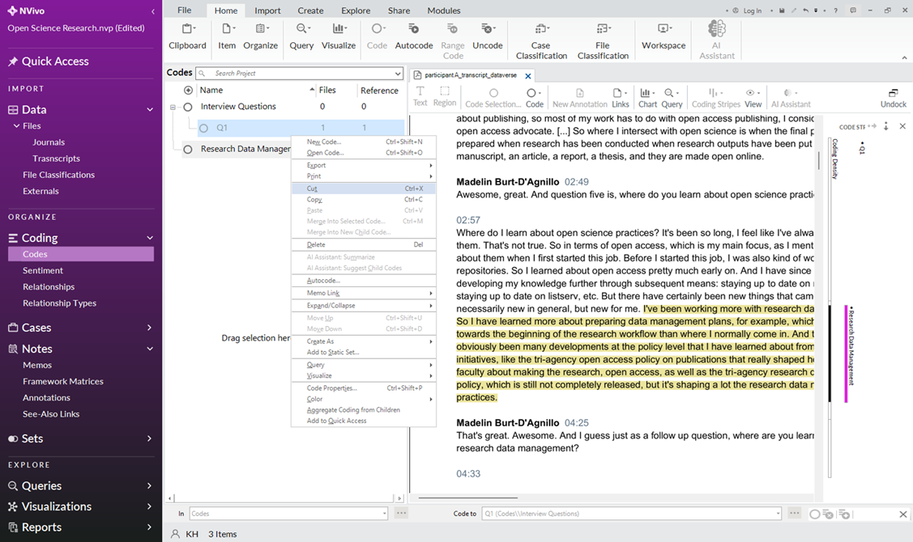

3.	Right-click in the white space in “Codes”.
4.	Right-click and select “Paste”.
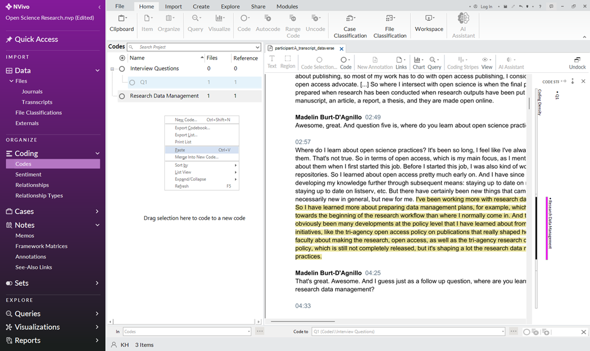

