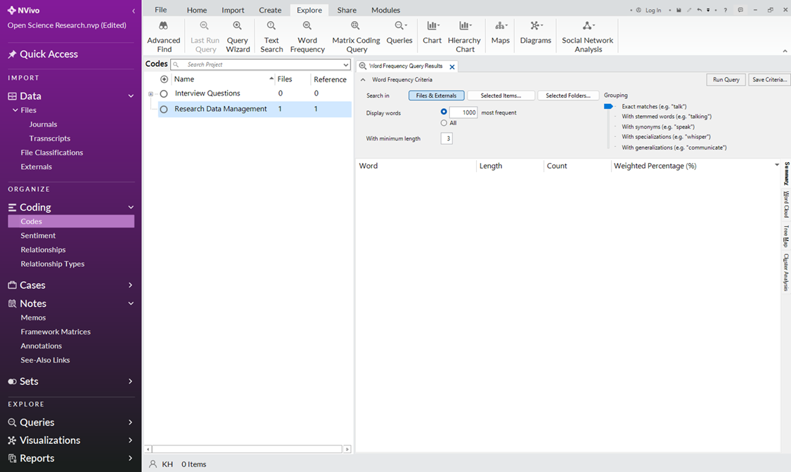
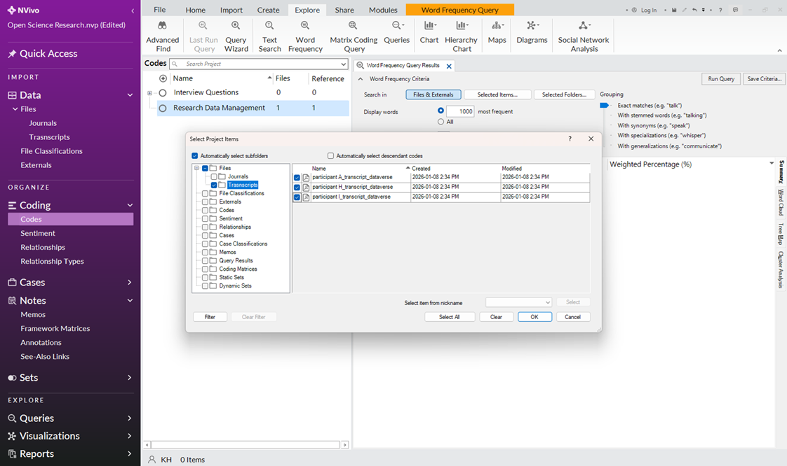
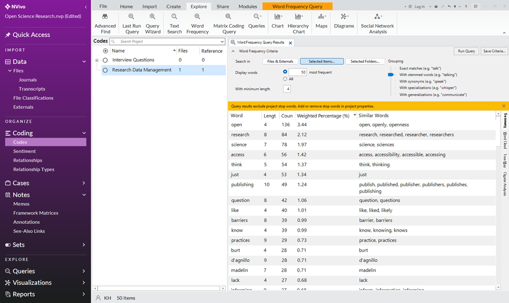
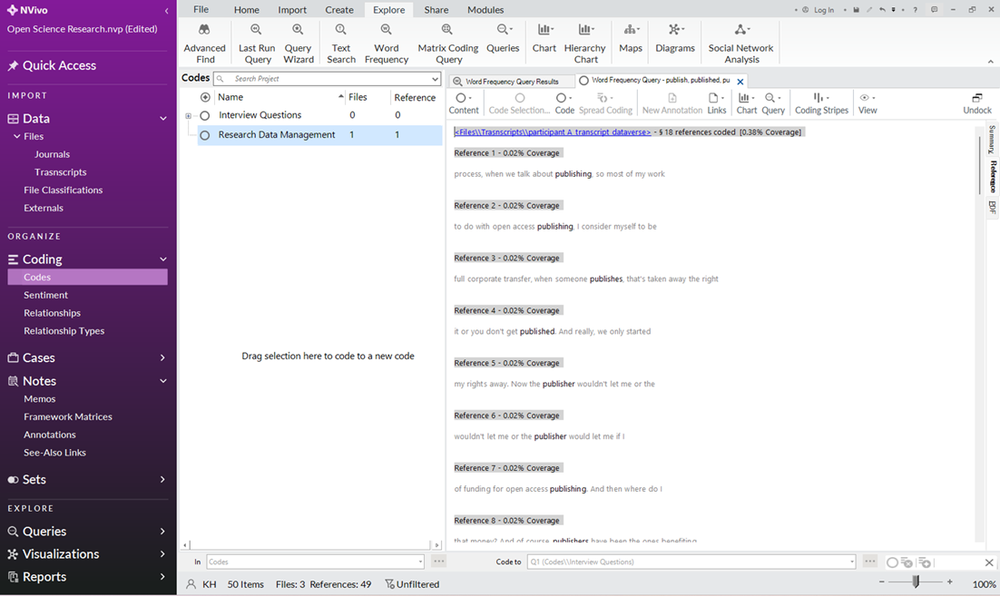
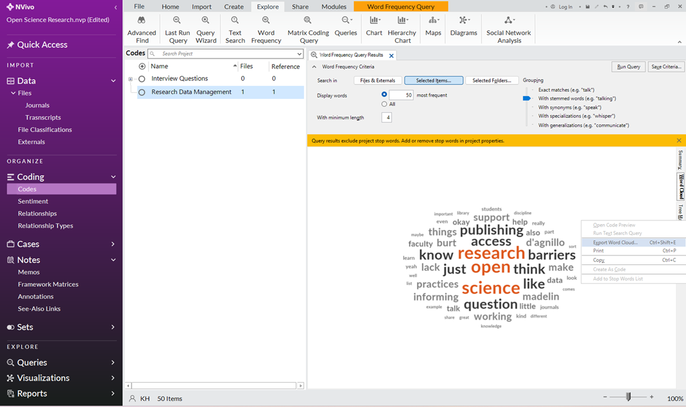
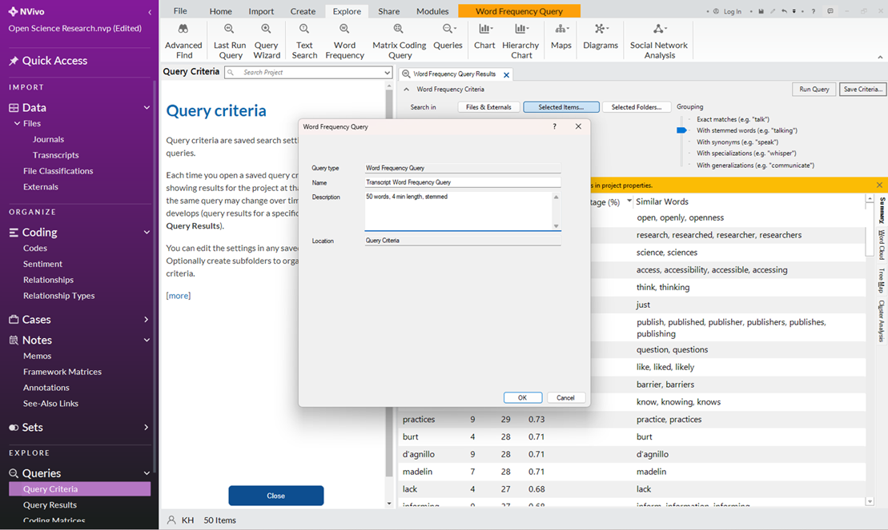
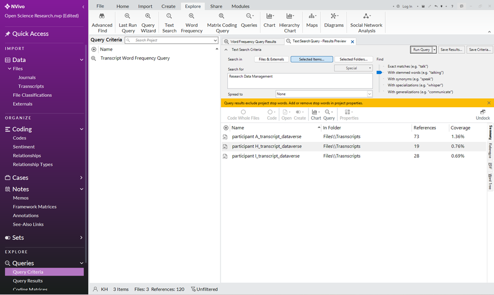
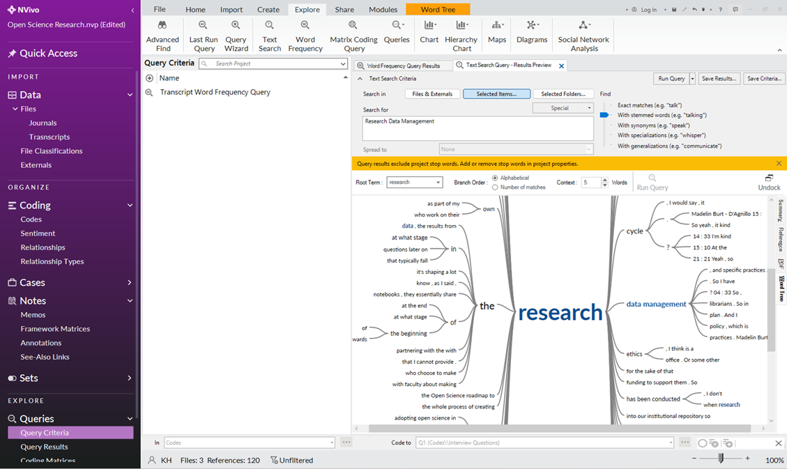
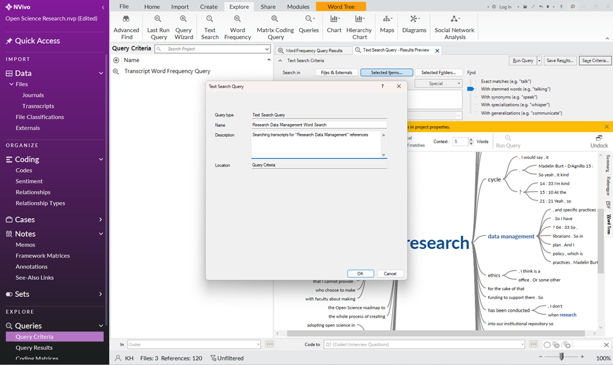
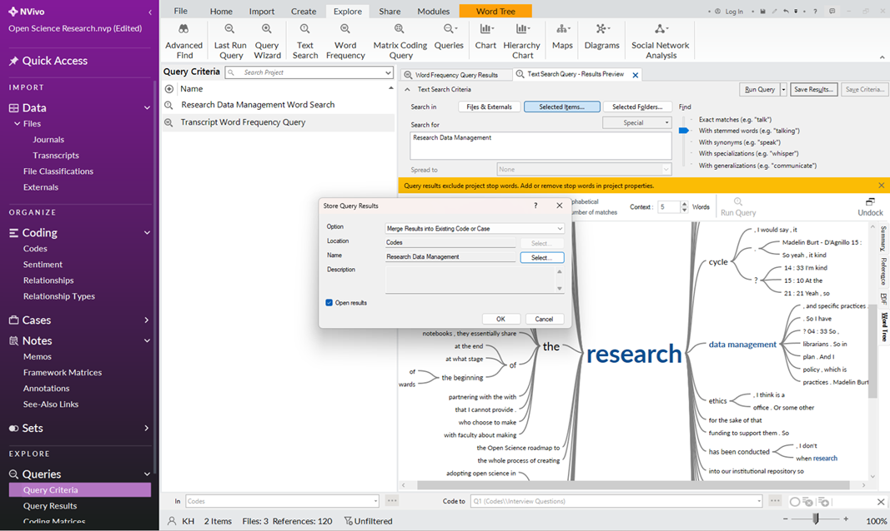

# Queries
NVivo offers various query types to help you filter, sort, and summarize data. This document specifically focuses on word and phrase queries that do not require coding. These queries are intended for the initial stages of data exploration and for generating ideas to follow up with other tools.

## Word Frequency Query
1.	Click “Explore” on the ribbon view (top pane).
2.	Click “Word Frequency”, found at the center of the “Explore” ribbon.

3.	Specify what files you want to search by clicking “Selected Items” under “Search In” (e.g. "Files" >  “Transcripts”).

4.	Adjust the number of display words, minimum length, and grouping as needed (e.g. 50 display words, 4 minimum length, with stemmed words)
5.	Click “Run Query”.

6.	Review the results. You can double-click on a word to see where it occurs in your data.

7.	Review the different result view types on the right-hand side of your screen (e.g. Word Cloud). You can right-click on the word cloud and click export to save.

8.	Click “Save Criteria” to save your search parameters for future use.
9.	Name the word frequency query according to your needs (e.g. “Transcript Word Frequency Query”).

## Text Search Query
1.	Click “Explore” on the ribbon view (top pane).
2.	Click “Text Search”, found at the center-left of the “Explore” ribbon.
3.	Specify what files you want to search by clicking “Selected Items” under “Search In” (e.g. Files  “Transcripts”).
4.	Type the word that you want to locate/review within your data (e.g. “Research Data Management”).

5.	Adjust the grouping and spread as needed.
6.	Click “Run Query”.
7.	Review the results. You can double-click on a word to see where it occurs in your data.
8.	Review the different result view types on the right-hand side of your screen (e.g. Word Tree). You can right-click on the word tree and click “Export Word Tree” to save.

9.	Click “Save Criteria” to save your search parameters for future use.
10.	Name the text search criteria according to your needs (e.g. “Research Data Management Word Search”). 

11.	Click “Save Results” to save the output of your text search query to a new or existing code (E.g. Select the “Merge Results into an Existing Code or Case " and select the “Research Data Management” code).

## Review Queries
1.	You can review your Queries by clicking on “Queries” on the navigation view (left pane).
2.	Click on your desired query subcategories (e.g. “Query Criteria” or “Query Results”)
3.	Double-click a query to open the related search results or criteria. NVivo restricts which queries can save parameters and which can save query results. If the save option isn't on your screen, it may not be available.

